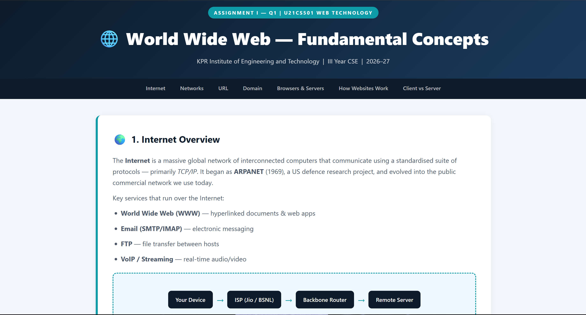
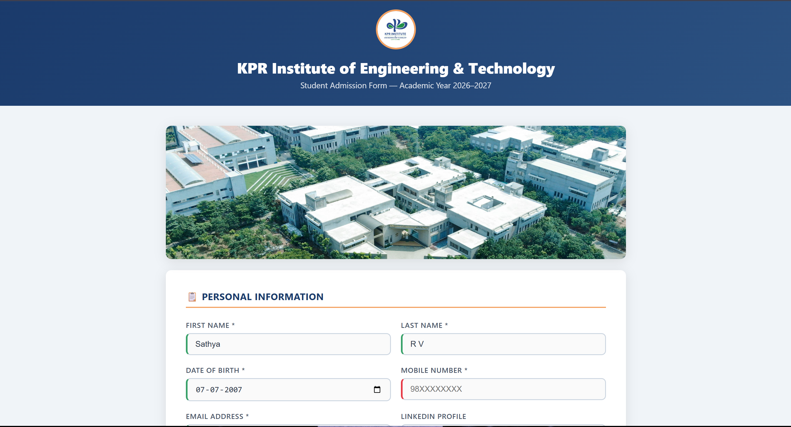
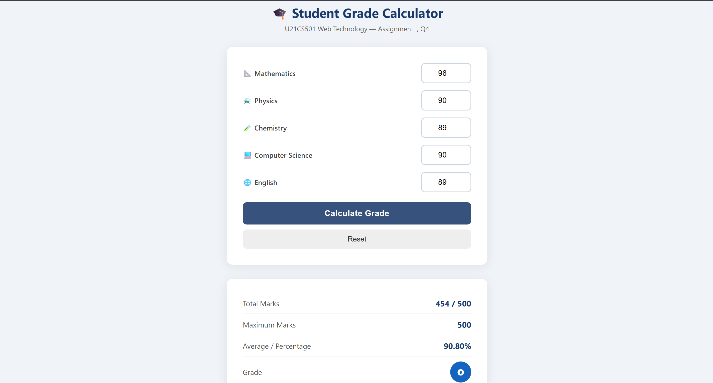
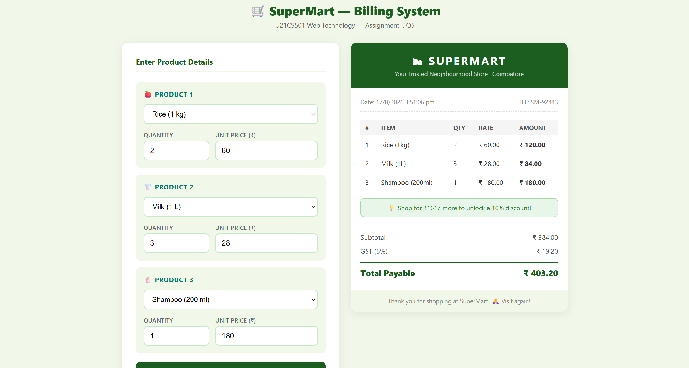

# 🌐 U21CS501 Web Technology — Assignment I

**KPR Institute of Engineering and Technology (Autonomous)**  
Department of Computer Science and Engineering | Academic Year 2026–27  
**Student Name:** Sathya R V &nbsp;|&nbsp; **Roll No:** 24CS192 &nbsp;|&nbsp; **Class:** III Year, V Semester, Section D

---

## 📌 Assignment Overview

This repository contains the complete solutions for **Assignment I** of the *U21CS501 Web Technology* course. All projects are built using clean, semantic HTML5, modern CSS3 styling & layouts, and modular Vanilla JavaScript with zero external frameworks.

| Question | Topic / Focus Area | File Path | Status |
| :--- | :--- | :--- | :---: |
| **Q1** | Web Technology & Network Fundamentals | [`q1/index.html`](q1/index.html) | ✅ Completed |
| **Q2** | Student Admission Form & HTML5 Media Elements | [`q2/admission.html`](q2/admission.html) | ✅ Completed |
| **Q3** | Velora Fashion Store Homepage (CSS3 Layouts & Animations) | [`q3/fashion.html`](q3/fashion.html) | ✅ Completed |
| **Q4** | Interactive Student Grade Calculator | [`q4/grade_calculator.html`](q4/grade_calculator.html) | ✅ Completed |
| **Q5** | SuperMart Automated Billing System | [`q5/billing.html`](q5/billing.html) | ✅ Completed |

---

## 📸 Visual Showcase & Project Highlights

---

### 🔹 Question 1: Web Technology Fundamentals
> **File:** [`q1/index.html`](q1/index.html)  
> **Key Concepts:** Internet architecture, TCP/IP protocol stack, URL decomposition, DNS resolution workflow, Web Browser vs. Web Server comparison, Request-Response lifecycle, and Client-side vs. Server-side scripting.

<div align="center">
  
</div>

---

### 🔹 Question 2: Student Admission Form with Media Elements
> **File:** [`q2/admission.html`](q2/admission.html)  
> **Key Concepts:** Comprehensive HTML5 form controls (`text`, `email`, `tel`, `date`, `number`, `url`, `file`, `radio`, `checkbox`, `range`), CSS3 pseudo-classes (`:focus`, `:required`, `:valid`), custom institute logo and banner, responsive YouTube video player embed, and HTML5 audio player.

<div align="center">
  
</div>

---

### 🔹 Question 3: Velora Fashion Store Homepage
> **File:** [`q3/fashion.html`](q3/fashion.html)  
> **Key Concepts:** High-end e-commerce landing page with sticky navigation, continuous ticker marquee animation, responsive CSS multi-column product grids, zoom hover transformations, promotional sale banners, and newsletter subscription form.

<div align="center">
  
</div>

---

### 🔹 Question 4: Interactive Student Grade Calculator
> **File:** [`q4/grade_calculator.html`](q4/grade_calculator.html)  
> **Key Concepts:** JavaScript variables, data types, arithmetic & comparison operators, input validation routines, iterative loops, conditional grading logic (`if-else if-else`), letter grade badge rendering, and dynamic DOM manipulation.

<div align="center">
  
</div>

---

### 🔹 Question 5: SuperMart Automated Billing System
> **File:** [`q5/billing.html`](q5/billing.html)  
> **Key Concepts:** Product data structures, dynamic price and quantity calculation, conditional discount logic (10% off on orders above ₹2000), GST computation (5%), formatted invoice receipt generation with unique bill number, and date-time stamps.

<div align="center">
  
</div>

---

## 🚀 How to Run

1. **Clone the Repository:**
   ```bash
   git clone https://github.com/<your-username>/Assignment1_WebTechnology.git
   ```
2. **Open in Browser:**
   - Double-click any `.html` file inside `q1/`, `q2/`, `q3/`, `q4/`, or `q5/` to view directly in Google Chrome, Microsoft Edge, Mozilla Firefox, or Safari.
   - No external web server, Node.js, or package installation is required.

---

## 🛠️ Technologies Used

- **HTML5:** Semantic structural tags (`<header>`, `<nav>`, `<main>`, `<section>`, `<footer>`), robust input controls, and multimedia elements (`<audio>`, `<iframe>`).
- **CSS3:** Flexbox, CSS Grid, multi-column layouts, CSS variables, keyframe animations, transitions, and media queries for responsive design.
- **Vanilla JavaScript:** DOM access & manipulation, event listeners, user-defined functions, array iteration, and conditional logic.

---

## 📝 Submission Details

- **Student Name:** Sathya R V
- **Roll Number:** 24CS192
- **Course:** U21CS501 — Web Technology
- **Department:** Computer Science and Engineering
- **Institution:** KPR Institute of Engineering and Technology (Autonomous)
- **Issue Date:** 10.08.2026
- **Submission Date:** 18.08.2026

